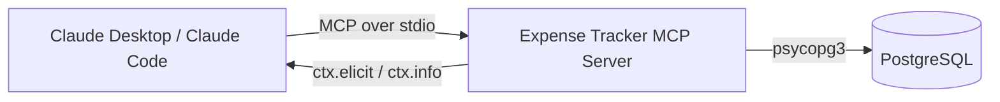

# Expense Tracker MCP Server

A Model Context Protocol (MCP) server that turns Claude into a personal
finance assistant — add, search, update, delete, and analyze expenses
stored in PostgreSQL, entirely through natural language.

Built with [FastMCP](https://gofastmcp.com), backed by PostgreSQL, and
tested through real usage in Claude Desktop rather than left as an
unverified script.

## Why this exists

Most MCP demo servers stop at "here's a tool that adds a row." This one
tries to go further: proper input validation with schema-level constraints,
graceful error handling instead of raw stack traces reaching the model,
a destructive-action confirmation flow, and a documented QA pass that
actually found and fixed three real bugs. See [TESTING.md](./TESTING.md)
for the full writeup.

## Features

- **Full CRUD** on expenses — add, get, update, delete
- **Search & filter** by category, payment method, and date range
- **Analytics** — monthly totals, category breakdown, top expenses,
  a zero-filled month-over-month spending trend
- **CSV export** for bulk data (cheaper on tokens than JSON for large
  result sets)
- **Safe deletes** — asks for confirmation via MCP elicitation where the
  client supports it, with a client-agnostic `confirm=true` fallback
  otherwise (see [Architecture Notes](#architecture-notes))
- **Read-only resources** (`expense://stats`, `expense://{id}`, etc.) and
  **reusable prompts** (`analyze_spending`, `budget_advice`) for MCP
  clients that support those primitives

## Tools

| Tool | Type | Description |
|---|---|---|
| `add_expense` | write | Add a new expense |
| `get_expense` | read | Fetch one expense by ID |
| `list_expenses` | read | Most recent expenses, newest first |
| `search_expenses` | read | Filter by category / payment method / date range |
| `update_expense` | write | Partial update — only provided fields change |
| `delete_expense` | write, destructive | Delete by ID, with confirmation |
| `get_monthly_summary` | read | Total spent + count for a given month |
| `get_category_summary` | read | Totals grouped by category, highest first |
| `get_top_expenses` | read | Largest N expenses, optional category filter |
| `get_spending_trend` | read | Month-over-month totals for the last N months (zero-filled) |
| `export_expenses_csv` | read | Bulk export as CSV text |

## Architecture



The server exposes 11 tools, 5 resources, and 2 prompts on top of a single
`expenses` table (schema in [`schema.sql`](./schema.sql)).

## Architecture notes

**Why `confirm=true` exists alongside elicitation.** MCP defines
elicitation (the server asking the client to show a confirmation dialog) as
an optional capability. Not every client implements it — Claude Desktop's
chat interface, for instance, currently supports the *tools* primitive
fully but not *resources* or *prompts*, and elicitation support varies by
client version. `delete_expense` tries elicitation first for a better UX,
but falls back to requiring an explicit `confirm=true` argument so the tool
still works — safely — on clients that can't show a native prompt. Details
and the bug this fixes are in [TESTING.md](./TESTING.md).

**Why categories are normalized at write time, not read time.** Early
testing showed `"food"` and `"Food"` being treated as the same category by
search (case-insensitive matching) but as different categories by the
summary tool (exact grouping). Rather than patch every read query to agree
on a matching rule, `add_expense`/`update_expense` normalize casing once,
at the point of insertion — so every downstream query is naturally
consistent without special-casing.

## Setup

### 1. Database

```bash
createdb expense_tracker
psql -d expense_tracker -f schema.sql
```

### 2. Environment

```bash
cp .env.example .env
# then edit .env with your real DATABASE_URL
```

### 3. Install & run

```bash
pip install -r requirements.txt
python expense_tracker.py
```

### 4. Connect it to Claude Desktop

Add to your `claude_desktop_config.json`:

```json
{
  "mcpServers": {
    "expense-tracker": {
      "command": "python",
      "args": ["/absolute/path/to/expense_tracker.py"]
    }
  }
}
```

Restart Claude Desktop and the tools will be available in a new
conversation.

## Tech stack

- **[FastMCP](https://gofastmcp.com)** — Python MCP server framework
- **PostgreSQL** + **psycopg3** — data layer
- **Pydantic** — schema validation (`Annotated` + `Field` constraints on
  every tool parameter)
- **Model Context Protocol** — tools, resources, prompts, elicitation

## Testing

See [TESTING.md](./TESTING.md) for the full QA writeup: two rounds,
65+ manually-run scenarios, three real bugs found and fixed (a broken
delete path, a spending-trend query that silently dropped zero-spend
months, and a category-casing inconsistency), plus adversarial checks
(SQL injection attempt, malformed dates, oversized input, delete
idempotency).

## Known limitations

- DB calls are synchronous `psycopg` calls inside `async def` tool
  functions — fine for stdio / single-user use, but under real concurrent
  HTTP traffic they'd block the event loop. `asyncpg` or a thread pool
  would be the next step if this ever needs to scale.
- `amount` is stored as `NUMERIC` in Postgres but surfaced as Python
  `float` in tool responses — acceptable for a personal tracker, not
  something I'd ship for a system doing real accounting.
- Resources and prompts are implemented to spec but not exercisable
  through Claude Desktop's current chat UI (tools-only support at this
  writing) — verified instead via MCP Inspector.
- No automated test suite yet — testing so far has been structured manual
  QA through the live client (see Roadmap).

## Roadmap

- [ ] `pytest` suite against a disposable test database
- [ ] Budget-limit tool (alert when a category exceeds a set threshold)
- [ ] Recurring-expense support
- [ ] Multi-currency handling
- [ ] Async DB layer for HTTP-transport deployment

## License

MIT — see [LICENSE](./LICENSE).

## Author

Built by Radhe as a portfolio project while learning Generative AI /
agentic tooling development (LangChain, LangGraph, and the MCP ecosystem).
