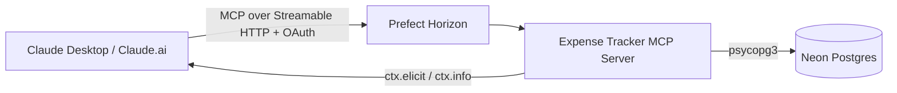

# Expense Tracker MCP Server

A Model Context Protocol (MCP) server that turns Claude into a personal
finance assistant — add, search, update, delete, and analyze expenses
stored in PostgreSQL, entirely through natural language.

Built with [FastMCP](https://gofastmcp.com), backed by PostgreSQL, and
tested through real usage in Claude Desktop rather than left as an
unverified script.

## Live

Deployed on [Prefect Horizon](https://horizon.prefect.io) (FastMCP's own
hosting platform), backed by [Neon](https://neon.tech) Postgres:

```
https://expense-tracker-mcp09.fastmcp.app/mcp
```

Add it in Claude Desktop/Claude.ai as a custom connector. Authentication
is required (GitHub OAuth via Horizon) — this is currently **single-tenant**:
everyone who authenticates shares the same underlying data, there is no
per-user isolation yet. That's active work, not an oversight — see
[Known Limitations](#known-limitations).

## Why this exists

Most MCP demo servers stop at "here's a tool that adds a row." This one
tries to go further: proper input validation with schema-level constraints,
graceful error handling instead of raw stack traces reaching the model,
a destructive-action confirmation flow, and a documented multi-round QA
pass that found and fixed real bugs — including a hard-to-catch cross-
currency aggregation issue and a stale-exchange-rate problem. See
[TESTING.md](./TESTING.md) for the full writeup.

## Features

- **Full CRUD** on expenses — add, get, update, delete
- **Search & filter** by category, payment method, and date range
- **Analytics** — monthly totals, category breakdown, top expenses,
  a zero-filled month-over-month spending trend, statistical anomaly
  detection (flags expenses that are N× a category's average)
- **Budgets** — set a monthly limit per category, check spend against it
- **Recurring expenses** — templates for rent/subscriptions/etc., safely
  re-runnable materialization into real expense rows (no duplicates)
- **Multi-currency** — per-expense currency, live-rate conversion with a
  static fallback if the lookup fails, and currency-scoped aggregation
  (every summary tool reports one currency at a time rather than silently
  mixing units — see [Architecture Notes](#architecture-notes))
- **Natural-language dates** — `"yesterday"`, `"last Tuesday"`, `"3 days ago"`,
  as well as strict `YYYY-MM-DD`
- **CSV export** for bulk data (cheaper on tokens than JSON for large
  result sets)
- **Safe deletes** — asks for confirmation via MCP elicitation where the
  client supports it, with a client-agnostic `confirm=true` fallback
  otherwise (see [Architecture Notes](#architecture-notes))
- **Read-only resources** (`expense://stats`, `expense://{id}`, etc.) and
  **reusable prompts** (`analyze_spending`, `budget_advice`) for MCP
  clients that support those primitives

## Tools

| Tool | Type | Description |
|---|---|---|
| `add_expense` | write | Add a new expense (accepts currency, natural-language dates) |
| `get_expense` | read | Fetch one expense by ID |
| `list_expenses` | read | Most recent expenses, newest first |
| `search_expenses` | read | Filter by category / payment method / date range |
| `update_expense` | write | Partial update — only provided fields change |
| `delete_expense` | write, destructive | Soft-delete by ID, with confirmation (recoverable) |
| `get_monthly_summary` | read | Total spent + count for a given month, one currency |
| `get_category_summary` | read | Totals grouped by category, one currency, highest first |
| `get_top_expenses` | read | Largest N expenses, optional category filter |
| `get_spending_trend` | read | Month-over-month totals, one currency (zero-filled) |
| `export_expenses_csv` | read | Bulk export as CSV text |
| `convert_currency` | read | Convert between currencies — live rate lookup, static fallback |
| `restore_expense` | write | Undo a soft delete |
| `list_deleted_expenses` | read | List soft-deleted expenses that can still be restored |
| `set_budget` | write | Set/update a category's monthly budget (INR) |
| `get_budgets` | read | List all configured budgets |
| `check_budget_status` | read | Spend vs. budget per category for a month |
| `add_recurring_expense` | write | Create a recurring expense template |
| `list_recurring_expenses` | read | List recurring templates |
| `deactivate_recurring_expense` | write | Stop future generation from a template |
| `generate_recurring_expenses` | write | Materialize a month's recurring expenses (idempotent) |
| `get_expense_anomalies` | read | Flag expenses that are N× their category's average |

## Architecture


```mermaid
flowchart LR
    A[Claude Desktop / Claude.ai] -- MCP over Streamable HTTP + OAuth --> B[Prefect Horizon]
    B --> C[Expense Tracker MCP Server]
    C -- psycopg3 --> D[(Neon Postgres)]
    C -- ctx.elicit / ctx.info --> A
```

The server also runs locally over stdio (see Setup below) — the same
codebase supports both transports; only the entrypoint differs.

The server exposes 22 tools, 5 resources, and 2 prompts on top of the
`expenses`, `budgets`, and `recurring_expenses` tables (schema in
[`schema.sql`](./schema.sql)).

## Architecture notes

**Why `confirm=true` exists alongside elicitation.** MCP defines
elicitation (the server asking the client to show a confirmation dialog) as
an optional capability. Not every client implements it — Claude Desktop's
chat interface, for instance, currently supports the *tools* primitive
fully but not *resources* or *prompts*, and elicitation support varies by
client version. `delete_expense` tries elicitation first for a better UX,
but falls back to requiring an explicit `confirm=true` argument so the tool
still works — safely — on clients that can't show a native prompt. Details
and the bug this fixes are in [TESTING.md](./TESTING.md).

**Why categories are normalized at write time, not read time.** Early
testing showed `"food"` and `"Food"` being treated as the same category by
search (case-insensitive matching) but as different categories by the
summary tool (exact grouping). Rather than patch every read query to agree
on a matching rule, `add_expense`/`update_expense` normalize casing once,
at the point of insertion — so every downstream query is naturally
consistent without special-casing.

**Why currency is partitioned, not merged.** Every aggregation tool
(`get_category_summary`, `get_monthly_summary`, `get_spending_trend`,
`get_expense_anomalies`) takes a `currency` parameter (default `INR`) and
only ever sums/averages within that one currency. There is deliberately no
"total across all currencies" anywhere — adding ₹100 and $100 together as
if they were the same unit is worse than not answering at all. A true
converted rollup (via `convert_currency`) is a possible future feature, not
something faked here. `check_budget_status` follows the same principle:
budgets are INR-only, so it explicitly filters spend to INR rather than
quietly including foreign-currency expenses in a category's budget check.

**Why `database.py` checks `DATABASE_URL` at connection time, not import
time.** Prefect Horizon's build pipeline statically imports the server
module to inspect its tools, before any runtime environment variables are
injected. An import-time `if not DATABASE_URL: raise` (the original
version of this file) fails that build step even though the real
deployment has `DATABASE_URL` set correctly — the check was just running
at the wrong moment. Deferred into `get_connection()`, it only fires when
something actually tries to open a connection, which is also just more
correct in general: a module shouldn't fail to import because of
configuration it doesn't need yet.

**Why there's a `/health` route defined manually.** FastMCP's Python
server doesn't expose one by default (unlike the separate TypeScript
`fastmcp` project, easy to conflate) — added via `@mcp.custom_route` for
platform health checks, deliberately outside the MCP protocol itself.

## Setup

### 1. Database

```bash
createdb expense_tracker
psql -d expense_tracker -f schema.sql
```

### 2. Environment

```bash
cp .env_example .env
# then edit .env with your real DATABASE_URL
```

### 3. Install & run

```bash
pip install -r requirements.txt
python expense_tracker_mcp_server.py
```

### 4. Connect it to Claude Desktop

Add to your `claude_desktop_config.json`:

```json
{
  "mcpServers": {
    "expense-tracker": {
      "command": "python",
      "args": ["/absolute/path/to/expense_tracker_mcp_server.py"]
    }
  }
}
```

Restart Claude Desktop and the tools will be available in a new
conversation.

### 5. (Optional) Deploy it instead of running locally

This repo also runs as-is on [Prefect Horizon](https://horizon.prefect.io):
connect your GitHub repo, point the entrypoint at
`expense_tracker_mcp_server.py:mcp`, and set `DATABASE_URL` as an
environment variable in Horizon's project settings (a
[Neon](https://neon.tech) connection string works well — free tier, no
expiry, unlike some alternatives). Horizon ignores the `if __name__ ==
"__main__":` block entirely and manages transport/host/port itself, so
local stdio and remote HTTP both work from the same file without a
platform-specific branch in the code.

## Tech stack

- **[FastMCP](https://gofastmcp.com)** — Python MCP server framework
- **PostgreSQL** + **psycopg3** — data layer
- **Pydantic** — schema validation (`Annotated` + `Field` constraints on
  every tool parameter)
- **Model Context Protocol** — tools, resources, prompts, elicitation
- **[Prefect Horizon](https://horizon.prefect.io)** + **[Neon](https://neon.tech)** — live deployment (GitHub-connected build, GitHub OAuth, managed Postgres)

## Testing

See [TESTING.md](./TESTING.md) for the full QA writeup: three rounds,
90+ manually-run scenarios, real bugs found and fixed at each stage —
a broken delete path, a spending-trend query that silently dropped
zero-spend months, a category-casing inconsistency, cross-currency
aggregation silently mixing units, and a missing CSV column — plus
adversarial checks (SQL injection attempt, malformed dates, oversized
input, delete idempotency, recurring-expense re-generation idempotency).

## Known limitations

- **Single-tenant: no per-user data isolation yet.** Everyone who
  authenticates through the live deployment reads and writes the same
  underlying rows — there's no `user_id` anywhere in the schema. Horizon's
  OAuth identifies *who* is calling (confirmed via `get_access_token()`
  and its token claims), but nothing in the application layer uses that
  identity to scope data yet. This is the active next piece of work, not
  an oversight.
- DB calls are synchronous `psycopg` calls inside `async def` tool
  functions — fine for the current scale, but under real concurrent
  HTTP traffic they'd block the event loop. `asyncpg` or a thread pool
  would be the next step if this ever needs to handle many simultaneous
  users.
- The startup schema-verification check (`_verify_schema()`) only runs
  under the `if __name__ == "__main__":` entrypoint — Horizon ignores
  that block entirely, so this safety net is currently silent on the
  platform this is actually deployed to. Still useful for local/other
  deployments; not yet solved for Horizon specifically.
- `amount` is stored as `NUMERIC` in Postgres but surfaced as Python
  `float` in tool responses — acceptable for a personal tracker, not
  something I'd ship for a system doing real accounting.
- Resources and prompts are implemented to spec but not exercisable
  through Claude Desktop's current chat UI (tools-only support at this
  writing) — verified instead via MCP Inspector.
- No automated test suite yet — testing so far has been structured manual
  QA through the live client.
- No true multi-currency rollup — every aggregation tool reports one
  currency at a time by design (see Architecture Notes above), not a
  blended total across currencies.
- `add_expense` has no duplicate-request protection.
- Recurring expense templates don't carry a currency field — generated
  rows are always INR.

## License

MIT — see [LICENSE](./LICENSE).

## Author

Built by Radhe as a portfolio project while learning Generative AI /
agentic tooling development (LangChain, LangGraph, and the MCP ecosystem).